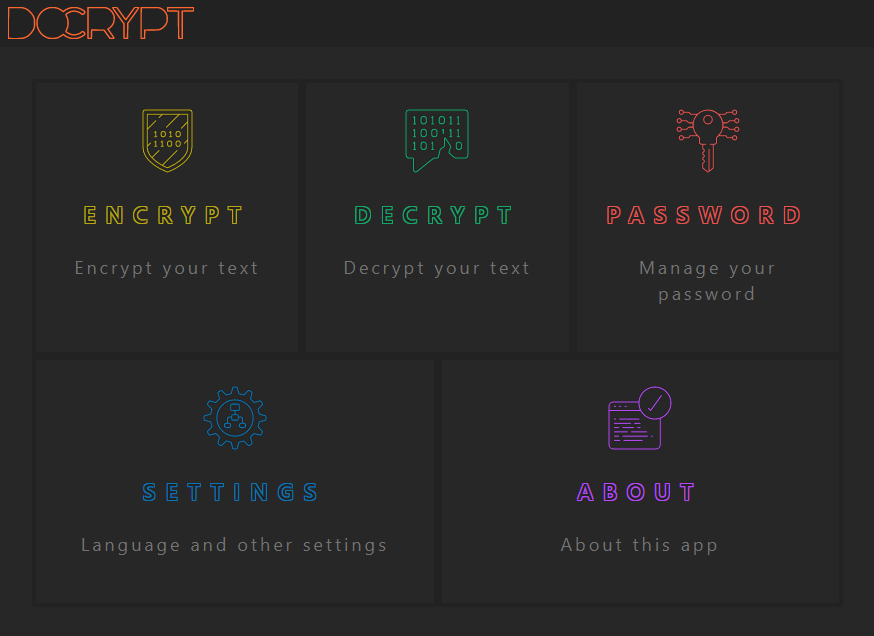
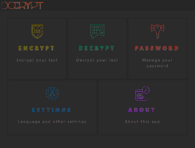

# DoCrypt

Encrypt and decrypt documents and images in your browser.

link: [docrypt.org/](https://docrypt.org/)

### How to create a new password

- Click on the "Password - manage your password" button
- Click on the "Random Password" button
- Click on the "Generate Random Password" button
- Click on the "Save QR Code to Image" button

### How to encrypt a text message

- Click on the "Encrypt - encrypt your text" button
- Write your text message and then click on the "Next" button
- Insert your password
- Click on the "Next" button
- Copy or share the encrypted message

### How to decrypt a text message

- Click on the "Decrypt - decrypt your text" button
- Paste or write the encrypted message and then click on the "Next" button
- Insert your password
- Click on the "Next" button
- Read the decrypted message
